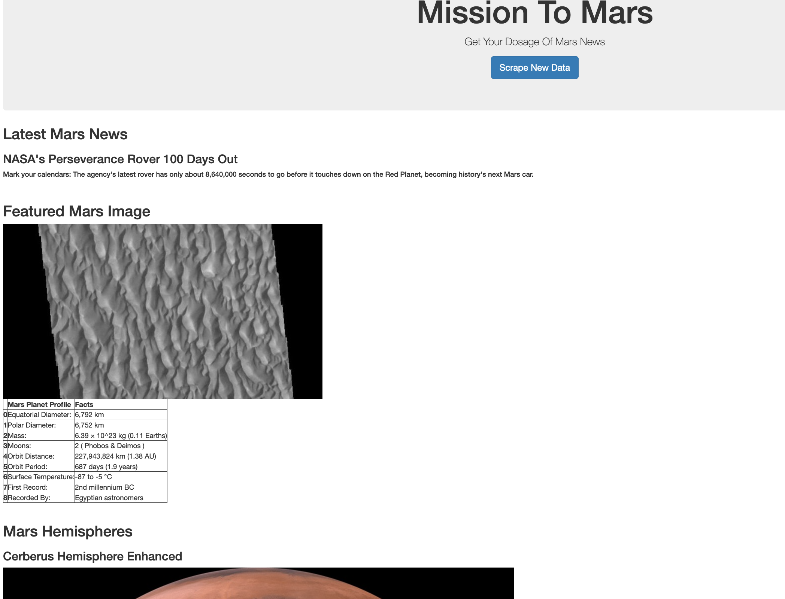
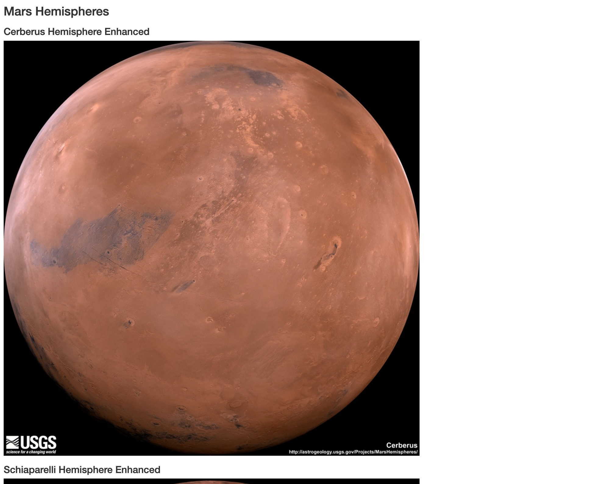
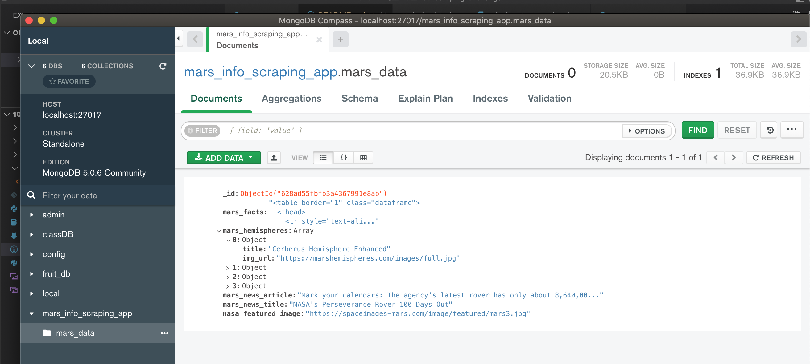

# 10__Mix__web-scraping-challenge
10__Mix__web-scraping-challenge

For this challenge, I scraped data about Mars the red planet from various sites that have information or images about Mars.

The website has a button that when pressed will use a function that goes to various websites and grab information or images about Mars.  It stores it in a MongoDB.

The website will pull the information from MongoDB database and post on the website in the right place.

As Mars news articles are updated on the original website, this website will pull the new article, update, and post to this website.

## Webpage Image 01

## Webpage Image 02

## Webpage Image 03
